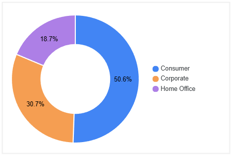
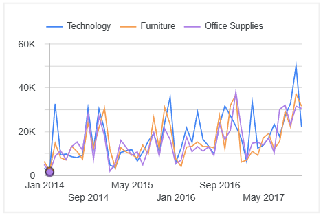
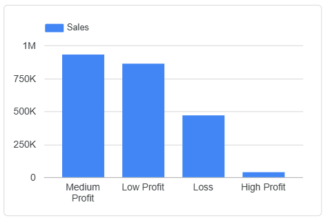

# Project in Data Analyst and Vibe Coding

## Superstore Sales & Profitability Analysis with Looker Studio
#### (Data-Driven Insights & Business Recommendations)
As a Data Analyst, I conducted an in-depth analysis of the Superstore Sales dataset (2014–2017) using Looker Studio as the primary tool for data visualization and storytelling.

The objective of this analysis was to uncover the key factors influencing profitability, focusing on product categories, regions, customer segments, and discount policies.

### Methodology
1. Data Cleaning & Quality Check  
2. Exploratory Data Analysis (EDA)  
3. Identify Sales & Profit Patterns  
4. Segmentation by Region, Category, Customer  
5. Business Insights & Recommendations  

## Exploratory Data Analysis (EDA)
- **Sales vs Profit**: Not always aligned → Some products have high sales but low profit  
- **Discount**: Large discounts often lead to losses  
- **Regional Trend**: West = highest sales, South = lowest margin  
- **Category**: Technology most profitable, Furniture often unprofitable  

### Key Findings
1. **Consumer segment** contributes ~50% of sales, but **Corporate** is more profitable.  
     

2. **Technology category** drives sales growth and profit (2014–2017 trend).  
     

3. **High-sales sub-categories** (Phones, Chairs, Tables) don’t always generate high profit.  

4. A significant portion of sales comes from **Medium & Low Profit segments**, with noticeable sales in **Loss category**.  
     

### Business Storytelling
> “While Superstore has grown in terms of sales, aggressive discounting and certain product categories have been eroding profit margins. Refocusing on profitable products and optimizing discount strategies will significantly enhance overall profitability.”

### Recommendations
1. **Discount Optimization**  
   - Limit discounts >30% for Furniture  
   - Apply profit-based discount policies  
   - *(Estimated Impact: +8–10% annual profit growth)*   

2. **Focus on Profitable Segments**  
   - Increase marketing towards **Corporate** and **Technology** products  
   - Develop bundling strategies for high-margin products  

3. **Regional Strategy**  
   - Improve distribution efficiency in the **South region**  
   - Review logistics and supply chain costs  

4. **Customer Retention**  
   - Launch loyalty program for top 20% customers  
   - Personalized campaigns for repeat purchases  

5. **Performance Monitoring**  
   - Implement **real-time KPI dashboard** in Looker Studio  
   [View Dashboard in Looker Studio](https://lookerstudio.google.com/reporting/27cf1dc1-394c-45e3-b4e9-b79a861d6acb)

### Summary for Portfolio
- Conducted in-depth analysis of **Superstore Sales dataset (2014–2017)**  
- Tools: **Looker Studio** for visualization & storytelling  
- Key Insights:  
  - Consumer = largest sales, but Corporate = higher profit  
  - Technology category is the main profit driver  
  - Furniture with high discounts causes losses  
  - 20% of customers contribute >60% revenue  
- Recommendations: optimize discounts, focus on profitable segments, improve South region strategy, and customer loyalty
---
 

